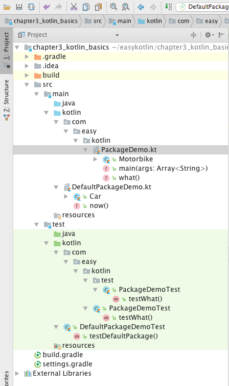
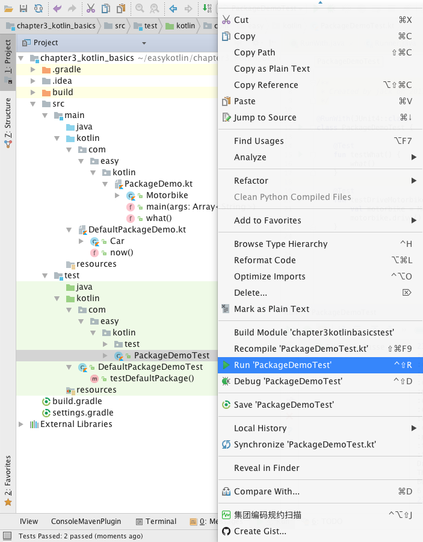
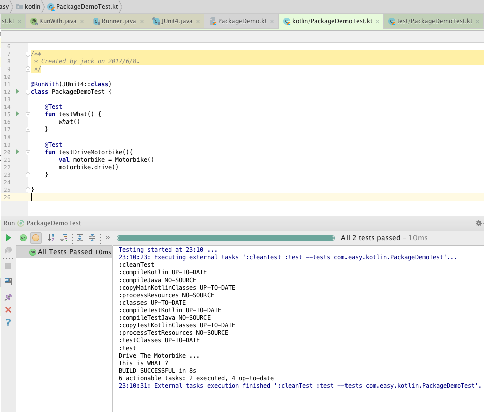

# Kotlin语言基础

> 掌握基础，持续练习

学习任何东西，都是一个由表及里的过程。学习一门编程语言也一样。对于一门编程语言来说，“表” 就是基本词汇（关键字、标识符等）、句子（表达式）和语法。

每一门编程语言的学习内容都会涉及： 运行环境、基础数据类型（数字、字符串、数组、集合、映射字典等） 、表达式、 流程控制 、类、方法（函数）等等，不同的语言会借鉴其他的语言特性，同时也会有各自的特性。这样我们就可以通过对比学习来加深理解。另外，我们还通过大量实践深入理解，达到熟练使用。

所谓“纸上得来终觉浅，绝知此事要躬行”是也。下面让我们开始吧。

## 包（package）

我们先来举个例子。比如说，程序员A写了一个类叫 JSON , 程序员B也写了一个类叫 JSON。然后，我们在写代码的时候，想要同时使用这两个类，该怎么区分呢？

一个答案是使用目录命名空间。对应在Java中，就是使用`package`来组织类，以确保类名的唯一性。上面说的例子，A写的类放到`package com.abc.fastjson` 中, B写的类就放到 `package com.bbc.jackjson`中。这样我们在代码中，就可以根据命名空间来分别使用这两个类。调用示例如下

```java
com.abc.fastjson.JSON.toJSONString()
com.bbc.jackjson.JSON.parseJSONObject()
```

在Kotlin中也沿袭了Java的 `package` 这个概念，同时做了一些扩展。

我们可以在`*.kt`文件开头声明`package`命名空间。例如在PackageDemo.kt源代码中，我们按照如下方式声明包

```kotlin
package com.easy.kotlin

fun what(){
    println("This is WHAT ?")
}

class Motorbike{
    fun drive(){
        println("Drive The Motorbike ...")
    }
}

fun main(args:Array<String>){
    println("Hello,World!")
}
```

包的声明处于源文件顶部。这里，我们声明了包 `com.easy.kotlin` , 里面定义了包级函数 `what()` , 同时定义了一个类 `Motorbike` 。另外，目录与包的结构无需匹配：源代码可以在文件系统的任意位置。

我们怎么使用这些类和函数呢？我们写一个Junit 测试类来示例说明。

首先，我们使用标准Gradle工程目录，对应的测试代码放在test目录下。具体目录结构如下



我们在测试源代码目录 `src/test/kotlin`下面新建一个包，跟`src/main/kotlin`在同一个 `package com.easy.kotlin`。然后，在此包下面新建一个测试类PackageDemoTest

```kotlin
package com.easy.kotlin

import org.junit.Test
import org.junit.runner.RunWith
import org.junit.runners.JUnit4

@RunWith(JUnit4::class)
class PackageDemoTest {

    @Test
    fun testWhat() {
        what()
    }

    @Test
    fun testDriveMotorbike(){
        val motorbike = Motorbike()
        motorbike.drive()
    }
}
```
其中，`what()` 函数跟` PackageDemoTest`类在同一个包命名空间下，可以直接调用，不需要 `import`。`Motorbike`类跟` PackageDemoTest`类也是同理分析。

如果不在同一个package下面，我们就需要import对应的类和函数。例如，我们在 `src/test/kotlin`目录下新建一个`package com.easy.kotlin.test`, 使用`package com.easy.kotlin` 下面的类和函数，示例如下

```kotlin
package com.easy.kotlin.test

import com.easy.kotlin.Motorbike
import com.easy.kotlin.what
import org.junit.Test
import org.junit.runner.RunWith
import org.junit.runners.JUnit4

@RunWith(JUnit4::class)
class PackageDemoTest {

    @Test
    fun testWhat() {
        what()
    }

    @Test
    fun testDriveMotorbike() {
        val motorbike = Motorbike()
        motorbike.drive()
    }
}
```
我们使用`import com.easy.kotlin.Motorbike`导入类，直接使用`import com.easy.kotlin.what`导入包级函数。

上面我们使用JUnit4测试框架。在`build.gradle`中的依赖是
```
testCompile group: 'junit', name: 'junit', version: '4.12'
```

右击测试类，点击执行



运行结果



另外，如果我们不定义package命令空间，则默认在根级目录。例如直接在`src/main/kotlin` 源代码目录下面新建 DefaultPackageDemo.kt 类

```kotlin
import java.util.*

fun now() {
    println("Now Date is: " + Date())
}

class Car{
    fun drive(){
        println("Drive The Car ... ")
    }
}
```

如果，我们同样在`src/test/kotlin` 目录下面新建测试类DefaultPackageDemoTest

```kotlin
import org.junit.Test
import org.junit.runner.RunWith
import org.junit.runners.JUnit4

@RunWith(JUnit4::class)
class DefaultPackageDemoTest {

    @Test
    fun testDefaultPackage() {
        now()
        val car = Car()
        car.drive()
    }

}
```

我们不需要import  `now()` 函数和 `Car`类，可以直接调用。如果我们在 `src/test/kotlin/com/easy/kotlin/PackageDemoTest.kt` 测试类里面调用`now()` 函数和 `Car`类， 我们按照下面的方式import

```
import now
import Car
```

PackageDemoTest.kt完整测试代码如下

```kotlin
package com.easy.kotlin

import now
import Car
import org.junit.Test
import org.junit.runner.RunWith
import org.junit.runners.JUnit4

@RunWith(JUnit4::class)
class PackageDemoTest {

    @Test
    fun testWhat() {
        what()
    }

    @Test
    fun testDriveMotorbike(){
        val motorbike = Motorbike()
        motorbike.drive()
    }

    @Test
    fun testDefaultPackage() {
        now()
        val car = Car()
        car.drive()
    }
}
```

另外， Kotlin会默认导入一些基础包到每个 Kotlin 文件中：

- kotlin.*
- kotlin.annotation.*
- kotlin.collections.*
- kotlin.comparisons.* （自 1.1 起）
- kotlin.io.*
- kotlin.ranges.*
- kotlin.sequences.*
- kotlin.text.*

根据目标平台还会导入额外的包：

JVM:

- java.lang.*
- kotlin.jvm.*

JS:

- kotlin.js.*

本小节示例工程源代码：https://github.com/EasyKotlin/chapter3_kotlin_basics/tree/package_demo