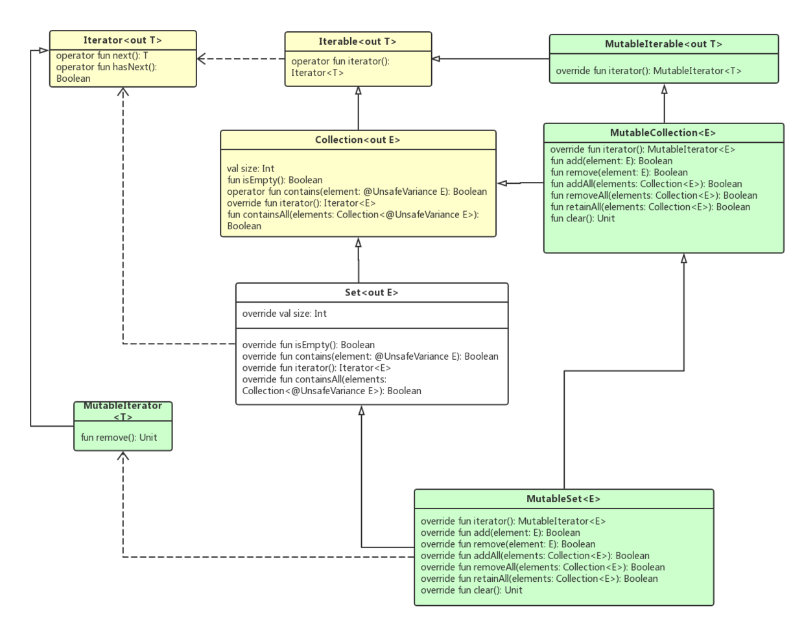

## Set

类似的，Kotlin中的Set也分为：不可变Set和支持增加和删除的可变MutableSet。

不可变Set同样是继承了Collection。MutableSet接口继承于Set, MutableCollection，同时对Set进行扩展，添加了对元素添加和删除等操作。

Set的类图结构如下：



### 空集

万物生于无。我们先来看下Kotlin中的空集：

```kotlin
internal object EmptySet : Set<Nothing>, Serializable {
    private const val serialVersionUID: Long = 3406603774387020532

    override fun equals(other: Any?): Boolean = other is Set<*> && other.isEmpty()
    override fun hashCode(): Int = 0
    override fun toString(): String = "[]"

    override val size: Int get() = 0
    override fun isEmpty(): Boolean = true
    override fun contains(element: Nothing): Boolean = false
    override fun containsAll(elements: Collection<Nothing>): Boolean = elements.isEmpty()

    override fun iterator(): Iterator<Nothing> = EmptyIterator

    private fun readResolve(): Any = EmptySet
}
```

空集继承了Serializable，表明是可被序列化的。它的size是0， isEmpty()返回true，hashCode()也是0。

下面是创建一个空集的代码示例：

```kotlin
>>> val emptySet = emptySet<Int>()
>>> emptySet
[]
>>> emptySet.size
0
>>> emptySet.isEmpty()
true
>>> emptySet.hashCode()
0
```

### 创建Set

#### `setOf`

首先，Set中的元素是不可重复的（任意两个元素 x, y 都不相等）。这里的元素 x, y 不相等的意思是：

```kotlin
x.hashCode() != y.hashCode() 
!x.equals(y) 

```

上面两个表达式值都为true 。

代码示例

```kotlin
>>> val list = listOf(1,1,2,3,3)
>>> list
[1, 1, 2, 3, 3]
>>> val set = setOf(1,1,2,3,3)
>>> set
[1, 2, 3]
```

Kotlin跟Java一样的，判断两个对象的是否重复标准是hashCode()和equals()两个参考值，也就是说只有两个对象的hashCode值一样与equals()为真时，才认为是相同的对象。所以自定义的类必须要要重写hashCode()和equals()两个函数。作为Java程序员，这里一般都会注意到。

创建多个元素的Set使用的函数是

```kotlin
setOf(vararg elements: T): Set<T> = if (elements.size > 0) elements.toSet() else emptySet()
```

这个toSet()函数是Array类的扩展函数，定义如下

```kotlin
public fun <T> Array<out T>.toSet(): Set<T> {
    return when (size) {
        0 -> emptySet()
        1 -> setOf(this[0])
        else -> toCollection(LinkedHashSet<T>(mapCapacity(size)))
    }
}
```

我们可以看出，setOf函数背后实际上用的是LinkedHashSet构造函数。关于创建Set的初始容量的算法是：

```kotlin
@PublishedApi
internal fun mapCapacity(expectedSize: Int): Int {
    if (expectedSize < 3) {
        return expectedSize + 1
    }
    if (expectedSize < INT_MAX_POWER_OF_TWO) {
        return expectedSize + expectedSize / 3
    }
    return Int.MAX_VALUE // 2147483647， any large value
}
```

也就是说，当元素个数n小于3，初始容量为n+1;
当元素个数n小于`2147483647 / 2 + 1` , 初始容量为 `n + n/3`;
否则，初始容量为`2147483647`。

如果我们想对一个List去重，可以直接使用下面的方式

```kotlin
>>> list.toSet()
[1, 2, 3]
```

上文我们使用`emptySet<Int>()`来创建空集，我们也可以使用setOf()来创建空集：

```kotlin
>>> val s = setOf<Int>()
>>> s
[]
```

创建1个元素的Set：

```kotlin
>>> val s = setOf<Int>(1)
>>> s
[1]
```

这个函数调用的是`setOf(element: T): Set<T> = java.util.Collections.singleton(element)`, 也是Java的Collections类里的方法。

#### `mutableSetOf(): MutableSet<T>`

创建一个可变Set。

函数定义

```kotlin
@SinceKotlin("1.1")
@kotlin.internal.InlineOnly
public inline fun <T> mutableSetOf(): MutableSet<T> = LinkedHashSet()
```

这个`LinkedHashSet()`构造函数背后实际上是`java.util.LinkedHashSet<E>`， 这就是Kotlin中的类型别名。

### 使用Java中的Set类

包kotlin.collections下面的TypeAliases.kt类中，有一些类型别名的定义如下：

```kotlin
@file:kotlin.jvm.JvmVersion

package kotlin.collections

@SinceKotlin("1.1") public typealias RandomAccess = java.util.RandomAccess


@SinceKotlin("1.1") public typealias ArrayList<E> = java.util.ArrayList<E>
@SinceKotlin("1.1") public typealias LinkedHashMap<K, V> = java.util.LinkedHashMap<K, V>
@SinceKotlin("1.1") public typealias HashMap<K, V> = java.util.HashMap<K, V>
@SinceKotlin("1.1") public typealias LinkedHashSet<E> = java.util.LinkedHashSet<E>
@SinceKotlin("1.1") public typealias HashSet<E> = java.util.HashSet<E>


// also @SinceKotlin("1.1")
internal typealias SortedSet<E> = java.util.SortedSet<E>
internal typealias TreeSet<E> = java.util.TreeSet<E>
```

从这里，我们可以看出，Kotlin中的`LinkedHashSet` , `HashSet`, `SortedSet`, `TreeSet` 就是直接使用的Java中的对应的集合类。

对应的创建的方法是

```kotlin
hashSetOf
linkedSetOf
mutableSetOf
sortedSetOf
```

代码示例如下：

```kotlin
>>> val hs = hashSetOf(1,3,2,7)
>>> hs
[1, 2, 3, 7]
>>> hs::class
class java.util.HashSet
>>> val ls = linkedSetOf(1,3,2,7)
>>> ls
[1, 3, 2, 7]
>>> ls::class
class java.util.LinkedHashSet
>>> val ms = mutableSetOf(1,3,2,7)
>>> ms
[1, 3, 2, 7]
>>> ms::class
class java.util.LinkedHashSet
>>> val ss = sortedSetOf(1,3,2,7)
>>> ss
[1, 2, 3, 7]
>>> ss::class
class java.util.TreeSet
```

我们知道在Java中，Set接口有两个主要的实现类HashSet和TreeSet：

HashSet : 该类按照哈希算法来存取集合中的对象，存取速度较快。
TreeSet : 该类实现了SortedSet接口，能够对集合中的对象进行排序。
LinkedHashSet：具有HashSet的查询速度，且内部使用链表维护元素的顺序，在对Set元素进行频繁插入、删除的场景中使用。

Kotlin并没有单独去实现一套HashSet、TreeSet和LinkedHashSet。如果我们在实际开发过程中，需要用到这些Set, 就可以直接用上面的方法。

### Set元素的加减操作 `plus` `minus`

Kotlin中针对Set做了一些加减运算的扩展函数, 例如：

```kotlin
operator fun <T> Set<T>.plus(element: T)
plusElement(element: T)
plus(elements: Iterable<T>)
operator fun <T> Set<T>.minus(element: T)
minusElement(element: T)
minus(elements: Iterable<T>)
```

代码示例：

```kotlin
>>> val ms = mutableSetOf(1,3,2,7)
>>> ms+10
[1, 3, 2, 7, 10]
>>> ms-1
[3, 2, 7]
>>> 
>>> ms + listOf(8,9)
[1, 3, 2, 7, 8, 9]
>>> ms - listOf(8,9)
[1, 3, 2, 7]
>>> ms - listOf(1,3)
[2, 7]
```