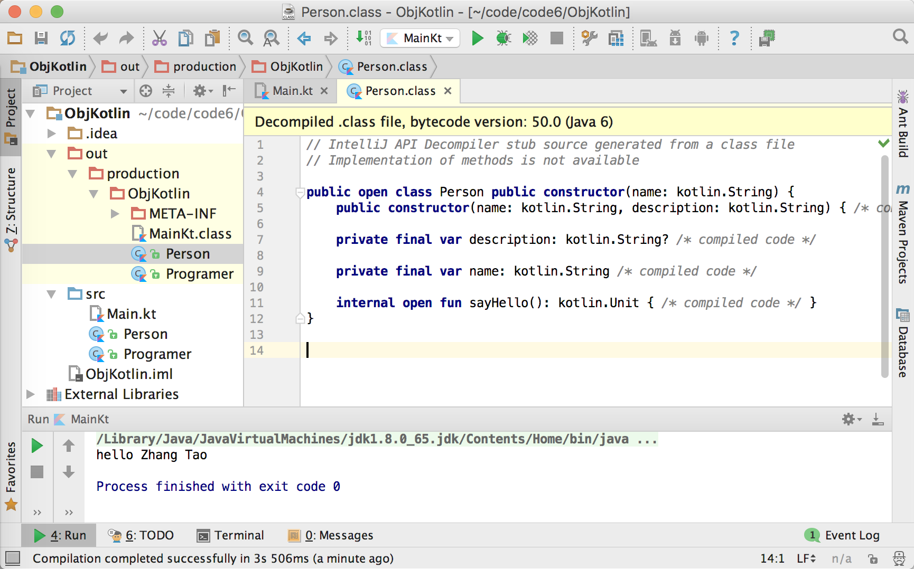

## Kotlin 的类特性(上)

前面三章的内容是写给希望快速了解 Kotlin 语言的大忙人的。		
而从本章开始，才会真正讲述 Kotlin 语言的神奇之处。

与 Java 相同，Kotlin 声明类的关键字是`class`。类声明由类名、类头和类体构成。		
其中`类头`和`类体`都是可选的; 如果一个类没有类体，那么花括号也是可以省略的。

### 1. 构造函数

Kotlin 的构造函数可以写在类头中，跟在类名后面，如果有注解还需要加上关键字`constructor`。这种写法声明的构造函数，我们称之为主构造函数。例如下面我们为`Person`创建带一个`String`类型参数的构造函数。

```kotlin
class Person(private val name: String) {
    fun sayHello() {
        println("hello $name")
    }
}
```

在构造函数中声明的参数，它们默认属于类的公有字段，可以直接使用，如果你不希望别的类访问到这个变量，可以用`private`修饰。

在主构造函数中不能有任何代码实现，如果有额外的代码需要在构造方法中执行，你需要放到`init`代码块中执行。同时，在本示例中由于需要更改 name 参数的值，我们将 val 改为 var,表明 name 参数是一个可改变的参数。

```kotlin
class Person(private var name: String) {
	
    init {
        name = "Zhang Tao"
    }

    internal fun sayHello() {
        println("hello $name")
    }
}

```

如果一个非抽象类没有声明任何(主或次)构造函数，它会有一个生成的不带参数的主构造函数。构造函数的可见性是 public。如果你不希望你的类 有一个公有构造函数,你需要声明一个带有非默认可见性的空的主构造函数。 

另外，在 JVM 上,如果主构造函数的所有的参数都有默认值，编译器会生成一个额外的无参构造函数,它将使用默认值。

### 2. 次级构造函数

一个类当然会有多个构造函数的可能，只有主构造函数可以写在类头中，其他的次级构造函数(Secondary Constructors)就需要写在类体中了。

```kotlin
class Person(private var name: String) {

    private var description: String? = null
    
    init {
        name = "Zhang Tao"
    }

    constructor(name: String, description: String) : this(name) {
        this.description = description
    }
    
    internal fun sayHello() {
        println("hello $name")
    }
}
```

这里我们让次级构造函数调用了主构造函数，完成 name 的赋值。由于次级构造函数不能直接将参数转换为字段，所以需要手动声明一个 description 字段，并为 description 字段赋值。

### 3. 修饰符

点开 IDEA，工程目录中的 out 列表，看到我们写完的 `Person`被编译为 class 文件后的样子。



#### 3.1 open 修饰符

Kotlin 默认会为每个变量和方法添加 final 修饰符。这么做的目的是为了程序运行的性能，其实在 Java 程序中，你也应该尽可能为每个类添加final 修饰符( 见 Effective Java 第四章 17 条)。 

为每个类加了`final`也就是说，在 Kotlin 中默认每个类都是不可被继承的。如果你确定这个类是会被继承的，那么你需要给这个类添加 `open` 修饰符。

#### 3.2 internal 修饰符

写过 Java 的同学一定知道，Java 有三种访问修饰符，public/private/protected，还有一个默认的包级别访问权限没有修饰符。

在 Kotlin 中，默认的访问权限是 public，也就是说不加访问权限修饰符的就是 public 的。而多增加了一种访问修饰符叫 `internal`。它是模块级别的访问权限。

何为模块(module)，我们称被一起编译的一系列 Kotlin 文件为一个模块。在 IDEA 中可以很明确的看到一个 `module`就是一个模块，当跨 `module` 的时候就无法访问另一个`module` 的 `internal` 变量或方法。

### 4. 一些特殊的类

#### 4.1 枚举类

在 Kotlin 中，每个枚举常量都是一个对象。枚举常量用逗号分隔。 例如我们写一个枚举类 Programer。

```kotlin
enum class Programer {
    JAVA, KOTLIN, C, CPP, ANDROID;
}
```

当它被编译成 class 后，将转为如下代码实际就是一个私有了构造函数的`kotlin.Enum`继承类。

```kotlin
public final enum class Programer 
private constructor() : kotlin.Enum<Programer> {
    JAVA, KOTLIN, C, CPP, ANDROID;
}
```

接着我们再来看`kotlin.Enum`这个类(节选)

```kotlin
public abstract class Enum<E : Enum<E>>
(name: String, ordinal: Int): Comparable<E> {
    companion object {}

    /**
     * Returns the name of this enum constant,
     *  exactly as declared in its enum declaration.
     */
    public final val name: String

    /**
     * Returns the ordinal of this enumeration 
     * constant (its position in its enum 
     * declaration, where the initial constant
     * is assigned an ordinal of zero).
     */
    public final val ordinal: Int

    public override final fun compareTo(other: E): Int
}
```

发现，其实在 Kotlin 中，枚举的本质是一个实现了`Comparable`的 class，其排序就是按照字段在枚举类中定义的顺序来的。

#### 4.2 sealed 密封类

sealed 修饰的类称为密封类，用来表示受限的类层次结构。例如当一个值为有限集中的 类型、而不能有任何其他类型时。在某种意义上,他们是枚举类的扩展:枚举类型的值集合也是受限的，但每个枚举常量只存在一个实例,而密封类的一个子类可以有可包含状态的多个实例。

#### 4.3 data 数据类

data 修饰的类称之为数据类。它通常用在我们写的一些 POJO 类上。

当 data 修饰后，会自动将所有成员用`operator`声明，即为这些成员生成类似 Java 的 getter/setter 方法。

本章就先介绍到这，下一章我们讲继承与组合，伪多继承与接口等内容。